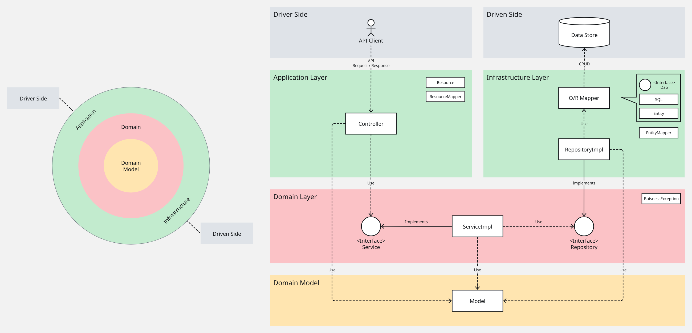

[English](./README.md) | [日本語](./README.ja.md)

<!-- omit in toc -->
# KeM's Todos

KeM's Todos はシンプルなタスク管理アプリケーションです。KeM198 の現時点の技術的スキルを総括するために作成されました。

このプロジェクトは次の技術や戦略を基に作成しています。

- REST API
- Clean Architecture (凹型アーキテクチャ)
- テスト駆動開発 (TDD)
- 自動テスト
- 継続的インテグレーション (CI)

> [!IMPORTANT]
> 日本語版ドキュメントは作成中です。
>
> 環境構築方法、API の実行サンプルなどは [英語版 README](./README.md) を参照してください。
