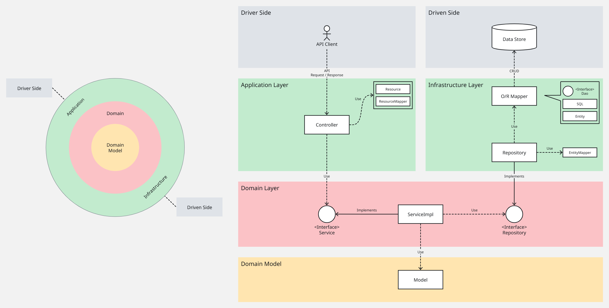

[English](README.md) | [日本語](README.ja.md)

<!-- omit in toc -->
# KeM's Todos

KeM's Todos is a to-do application that serves as a showcase of my current skills.

This project focuses on:

- Developing a **REST API** following **Clean Architecture**
- Applying **Test-Driven Development (TDD)** and **Automated Testing**
- Maintaining code quality through **Continuous Integration (CI)**



<!-- omit in toc -->
## TOC

- [1. Application Overview](#1-application-overview)
    - [1.1. Frontend](#11-frontend)
    - [1.2. Backend](#12-backend)
    - [1.3. Test Strategy](#13-test-strategy)
- [2. Requirements](#2-requirements)
    - [2.1. Required](#21-required)
    - [2.2. Recommended](#22-recommended)
- [3. Setup](#3-setup)
    - [3.1. Setup Environment](#31-setup-environment)
    - [3.2. Run Database server](#32-run-database-server)
    - [3.3. Run API server](#33-run-api-server)
    - [3.4. Run Web server](#34-run-web-server)
- [4. Development](#4-development)
    - [4.1. Execute Tests](#41-execute-tests)
- [5. Demo: Todo application](#5-demo-todo-application)
- [6. Demo: Backend APIs](#6-demo-backend-apis)
    - [6.1. `/v1/greeting`](#61-v1greeting)
    - [6.2. `/v1/fizzbuzz`](#62-v1fizzbuzz)
    - [6.3. `/v1/todos`](#63-v1todos)
    - [6.4. `/v1/error`](#64-v1error)
- [7. References](#7-references)

## 1. Application Overview

This application follows a multi-layer architecture.

### 1.1. Frontend

The frontend application is built with [Next.js](https://nextjs.org/).

- [todos-web](./src/frontend/todos-web/)
    - Acts as the **Driver Side** interface.
    - Provides a user interface for end users.

> [!NOTE]
> Currently working on the [develop branch](https://github.com/kem198/kems-todos/tree/develop/src/frontend/todos-web). Coming soon...

### 1.2. Backend

The backend application is built using a [Multi Module Project](https://spring.io/guides/gs/multi-module) approach with [Spring Boot](https://spring.io/projects/spring-boot).

- [todos-api](./src/backend/modules/todos-api/)
    - Contains **Application Layer**.
    - Handles API requests/responses and calls business logic.
- [todos-core](./src/backend/modules/todos-core/)
    - Contains **Domain Layer**.
    - Provides domain models and business logic.
- [todos-infrastructure](./src/backend/modules/todos-infrastructure/)
    - Contains **Infrastructure Layer**.
    - Executes CRUD operations on the data store.

### 1.3. Test Strategy

This project maintains code quality with automated testing and CI.

- Frontend: [Vitest](https://vitest.dev/)
    - Executes unit tests for shared utilities.
- Backend: [JUnit](https://junit.org/)
    - Executes unit tests for shared classes.
    - Executes integration tests for APIs.
- E2E: [Playwright](https://playwright.dev/)
    - Validates end-to-end user flows.
- CI: [GitHub Actions](https://github.co.jp/features/actions)
    - Runs automated build and test pipelines.

## 2. Requirements

### 2.1. Required

- [Node.js](https://nodejs.org/ja)
- [JDK 21](https://openjdk.org/projects/jdk/21/)
- [Docker Engine](https://docs.docker.com/engine/)

### 2.2. Recommended

- [Ubuntu on WSL](https://learn.microsoft.com/ja-jp/windows/wsl/)
- [Volta](https://volta.sh/)
- [SDKMAN!](https://sdkman.io/)
- [Visual Studio Code](https://azure.microsoft.com/ja-jp/products/visual-studio-code)

## 3. Setup

### 3.1. Setup Environment

```shell
# Example Environment: Ubuntu 24.04 on WSL
$ lsb_release -a
No LSB modules are available.
Distributor ID: Ubuntu
Description:    Ubuntu 24.04.2 LTS
Release:        24.04
Codename:       noble

# Install SDKMAN!
$ curl -s "https://get.sdkman.io" | bash
$ sdk version
SDKMAN!
script: 5.19.0
native: 0.7.4 (linux x86_64)

# Install OpenJDK 21 (Eclipse Temurin Java 21.0.6)
$ sdk install java 21.0.6-tem
$ java --version
openjdk 21.0.6 2025-01-21 LTS
OpenJDK Runtime Environment Temurin-21.0.6+7 (build 21.0.6+7-LTS)
OpenJDK 64-Bit Server VM Temurin-21.0.6+7 (build 21.0.6+7-LTS, mixed mode, sharing)

# Clone This repository
$ cd /path/to/your/repo/
$ git clone https://github.com/kem198/practice-restful-apps.git

# Moving api apps directory
$ cd practice-restful-apps
```

### 3.2. Run Database server

```sh
# Current directory is the repository root
$ pwd
/path/to/your/repo/practice-restful-apps

# Copy and rename .env.example to .env
$ cp .env.example .env

# (Optional) Edit .env for your settings
$ vim .env

# Start the database service
$ docker compose up -d

# (Optional) Check running the Docker service
$ docker compose ls
NAME                    STATUS              CONFIG FILES
practice-restful-apps   running(1)          /home/kenkenpa198/works/repos/dev/test/practice-restful-apps/docker-compose.yml

# (Optional) Connect to the database and execute queries
$ docker compose exec db psql -U postgres -d todos_db
psql (17.4 (Debian 17.4-1.pgdg120+2))
Type "help" for help.

todos_db=# \d
               List of relations
 Schema |      Name       |   Type   |  Owner
--------+-----------------+----------+----------
 public | examples        | table    | postgres
 public | examples_id_seq | sequence | postgres
(2 rows)

todos_db=# SELECT * FROM examples;
 id |   name    |         created_at
----+-----------+----------------------------
  1 | Example 1 | 2025-05-01 21:24:38.143514
  2 | Example 2 | 2025-05-01 21:24:38.143514
  3 | Example 3 | 2025-05-01 21:24:38.143514
(3 rows)

todos_db=# exit
```

### 3.3. Run API server

```shell
# Change to api application root directory
$ cd src/backend
$ pwd
/path/to/your/repo/practice-restful-apps/src/backend

# Build application
$ ./gradlew build

# Run application
$ java -jar modules/todos-api/build/libs/todos-api-0.0.1-SNAPSHOT.jar

# Open new terminal and request to API!
$ curl 'http://localhost:8080/v1/greeting/hello'
Hello, World!
```

> [!TIP]
> Run the API server for development (with hot reload).
>
> ```sh
> ./gradlew bootRun
> ```

If you want to see more commands, please refer to [backend/README.md](./src/backend/README.md).

### 3.4. Run Web server

> [!NOTE]
> Currently working on the [develop branch](https://github.com/kem198/kems-todos/tree/develop/src/frontend/todos-web). Coming soon...

## 4. Development

### 4.1. Execute Tests

> [!NOTE]
> This section is not written yet. Coming soon...

## 5. Demo: Todo application

> [!NOTE]
> Currently working on the [develop branch](https://github.com/kem198/kems-todos/tree/develop/src/frontend/todos-web). Coming soon...

## 6. Demo: Backend APIs

### 6.1. `/v1/greeting`

```sh
$ curl -i -X GET 'http://localhost:8080/v1/greeting/hello'
HTTP/1.1 200
Content-Type: text/plain;charset=UTF-8
Content-Length: 14
Date: Sat, 19 Jul 2025 17:05:36 GMT

Hello, World!

$ curl -i -X GET 'http://localhost:8080/v1/greeting/hello?name=KeM198'
HTTP/1.1 200
Content-Type: text/plain;charset=UTF-8
Content-Length: 15
Date: Sat, 19 Jul 2025 17:06:00 GMT

Hello, KeM198!
```

### 6.2. `/v1/fizzbuzz`

```sh
$ curl -s -D /dev/stderr -X GET 'http://localhost:8080/v1/fizzbuzz/convert?num=3' | jq
HTTP/1.1 200
Content-Type: application/json
Transfer-Encoding: chunked
Date: Mon, 28 Apr 2025 05:43:50 GMT

{
  "result": "Fizz"
}

$ curl -s -D /dev/stderr -X GET 'http://localhost:8080/v1/fizzbuzz/convert' | jq
HTTP/1.1 400
Content-Type: application/problem+json
Transfer-Encoding: chunked
Date: Mon, 28 Apr 2025 05:44:28 GMT
Connection: close

{
  "type": "about:blank",
  "title": "Missing Parameter",
  "status": 400,
  "detail": "The 'num' query parameter is required.",
  "instance": "/v1/fizzbuzz"
}

$ curl -s -D /dev/stderr -X GET 'http://localhost:8080/v1/fizzbuzz/convert?num=abc' | jq
HTTP/1.1 400
Content-Type: application/problem+json
Transfer-Encoding: chunked
Date: Mon, 28 Apr 2025 05:44:49 GMT
Connection: close

{
  "type": "about:blank",
  "title": "Invalid Number Format",
  "status": 400,
  "detail": "The 'num' query parameter must be a valid integer.",
  "instance": "/v1/fizzbuzz"
}
```

### 6.3. `/v1/todos`

```sh
$ curl -s -D /dev/stderr -X GET 'http://localhost:8080/v1/todos' | jq
HTTP/1.1 200
Content-Type: application/json
Transfer-Encoding: chunked
Date: Sun, 04 May 2025 09:31:59 GMT

[]

$ curl -s -D /dev/stderr -X POST http://localhost:8080/v1/todos \
-H 'Content-Type: application/json' \
-d '{"todoTitle": "Hello World!"}' | jq
HTTP/1.1 201
Content-Type: application/json
Transfer-Encoding: chunked
Date: Sun, 04 May 2025 09:30:59 GMT

{
  "todoId": "a9502e35-b177-43ea-9639-ba529360e2cc",
  "todoTitle": "Hello World!",
  "finished": false,
  "createdAt": "2025-05-04T09:30:59.728+00:00"
}

$ curl -s -D /dev/stderr -X GET 'http://localhost:8080/v1/todos' | jq
HTTP/1.1 200
Content-Type: application/json
Transfer-Encoding: chunked
Date: Sun, 04 May 2025 09:31:26 GMT

[
  {
    "todoId": "a9502e35-b177-43ea-9639-ba529360e2cc",
    "todoTitle": "Hello World!",
    "finished": false,
    "createdAt": "2025-05-04T09:30:59.728+00:00"
  }
]

$ curl -s -D /dev/stderr -X GET 'http://localhost:8080/v1/todos/a9502e35-b177-43ea-9639-ba529360e2cc' | jq
HTTP/1.1 200
Content-Type: application/json
Transfer-Encoding: chunked
Date: Sun, 04 May 2025 09:40:29 GMT

{
  "todoId": "a9502e35-b177-43ea-9639-ba529360e2cc",
  "todoTitle": "Hello World!",
  "finished": false,
  "createdAt": "2025-05-04T09:40:06.785+00:00"
}

$ curl -s -D /dev/stderr -X PUT 'http://localhost:8080/v1/todos/a9502e35-b177-43ea-9639-ba529360e2cc' | jq
HTTP/1.1 200
Content-Type: application/json
Transfer-Encoding: chunked
Date: Sun, 04 May 2025 09:47:41 GMT

{
  "todoId": "a9502e35-b177-43ea-9639-ba529360e2cc",
  "todoTitle": "Hello World!",
  "finished": true,
  "createdAt": "2025-05-04T09:46:24.529+00:00"
}

$ curl -s -D /dev/stderr -X DELETE 'http://localhost:8080/v1/todos/a9502e35-b177-43ea-9639-ba529360e2cc' | jq
HTTP/1.1 204 Date: Sun, 04 May 2025 09:51:12 GMT

$ curl -s -D /dev/stderr -X GET 'http://localhost:8080/v1/todos' | jq
HTTP/1.1 200
Content-Type: application/json
Transfer-Encoding: chunked
Date: Sun, 04 May 2025 09:51:28 GMT

[]
```

### 6.4. `/v1/error`

```sh
$ curl -s -D /dev/stderr -X GET 'http://localhost:8080/v1/error' | jq
HTTP/1.1 500
Content-Type: application/problem+json
Transfer-Encoding: chunked
Date: Tue, 06 May 2025 06:09:11 GMT
Connection: close

{
  "type": "about:blank",
  "title": "Internal Server Error",
  "status": 500,
  "instance": "/v1/error"
}

$ curl -s -D /dev/stderr -X GET 'http://localhost:8080/v1/error/detail' | jq
HTTP/1.1 500
Content-Type: application/problem+json
Transfer-Encoding: chunked
Date: Tue, 06 May 2025 06:19:59 GMT
Connection: close

{
  "type": "https://example.com",
  "title": "Internal Server Error",
  "status": 500,
  "detail": "Customized error details",
  "instance": "/v1/error/detail"
}

$ curl -s -D /dev/stderr -X GET 'http://localhost:8080/v1/error/throw-system-error' | jq
HTTP/1.1 500
Content-Type: application/problem+json
Transfer-Encoding: chunked
Date: Tue, 06 May 2025 10:02:16 GMT
Connection: close

{
  "type": "about:blank",
  "title": "Internal Server Error",
  "status": 500,
  "detail": "An unexpected error occurred. Please contact support if the problem persists.",
  "instance": "/v1/error/throw-system-error"
}
```

## 7. References

<!-- omit in toc -->
### Architecture

- [Macchinetta Server Framework (1.x) Development Guideline](https://macchinetta.github.io/server-guideline-thymeleaf/current/ja/index.html)
    - [2.4. アプリケーションのレイヤ化](https://macchinetta.github.io/server-guideline-thymeleaf/current/ja/Overview/ApplicationLayering.html)
    - [5.1. RESTful Web Service](https://macchinetta.github.io/server-guideline-thymeleaf/current/ja/ArchitectureInDetail/WebServiceDetail/REST.html)
    - [11.1. チュートリアル(Todoアプリケーション)](https://macchinetta.github.io/server-guideline-thymeleaf/current/ja/Tutorial/TutorialTodo.html)
    - [11.2. チュートリアル(Todoアプリケーション REST編)](https://macchinetta.github.io/server-guideline-thymeleaf/current/ja/Tutorial/TutorialREST.html)
- [ちょうぜつソフトウェア設計入門 \| 技術評論社](https://gihyo.jp/book/2022/978-4-297-13234-7)

<!-- omit in toc -->
### Web API

- [Web API: The Good Parts - O'Reilly Japan](https://www.oreilly.co.jp/books/9784873116860/)
- [RFC 9457 - Problem Details for HTTP APIs](https://datatracker.ietf.org/doc/html/rfc9457)
    - [RFC 9457 - Problem Details for HTTP APIs 日本語訳](https://tex2e.github.io/rfc-translater/html/rfc9457.html)
    - [エラーレスポンス :: Spring Framework - リファレンス](https://spring.pleiades.io/spring-framework/reference/web/webmvc/mvc-ann-rest-exceptions.html)
    - [REST API Common Spec としての HTTP Status Code と Error の提案 - Affamative Way](https://cos31.hatenablog.jp/entry/2023/12/14/093435)
    - [Spring Boot 3.0 で入った RFC7807 サポートを色々試す \#Java - Qiita](https://qiita.com/koji-cw/items/422140bd7752e4a82baf)
    - [Spring Boot で Problem Details に対応するための kotlin での実装](https://zenn.dev/bm_sms/articles/aec9aeca1fee34)

<!-- omit in toc -->
### TDD

- [テスト駆動開発 \| Ohmsha](https://www.ohmsha.co.jp/book/9784274217883/)
- [TDD Boot Camp 2020 Online \#1 基調講演/ライブコーディング - YouTube](https://www.youtube.com/watch?v=Q-FJ3XmFlT8)

<!-- omit in toc -->
### Spring Boot

- [Spring Boot in Visual Studio Code](https://code.visualstudio.com/docs/java/java-spring-boot)
- [Spring Boot REST API の作成 - 公式サンプルコード](https://spring.pleiades.io/guides/gs/rest-service)
- [Spring Boot マルチモジュールプロジェクトの作成 - 公式サンプルコード](https://spring.pleiades.io/guides/gs/multi-module)

<!-- omit in toc -->
### Doma

- [Doma へようこそ — Doma ドキュメント](https://docs.domaframework.org/ja/stable/)
    - [アプリケーションのビルド — Doma ドキュメント](https://docs.domaframework.org/ja/stable/build/)
    - [Doma CodeGen プラグイン — Doma ドキュメント](https://docs.domaframework.org/ja/stable/codegen/)
    - [domaframework/getting-started: Getting-started project for Doma](https://github.com/domaframework/getting-started)
    - [domaframework/simple-examples: Doma Simple Examples](https://github.com/domaframework/simple-examples)

<!-- omit in toc -->
### Others

- [SDK Installation Candidates \| SDKMAN! the Software Development Kit Manager](https://sdkman.io/sdks/)
- [curl -s -f -D /dev/stderr が優勝 – 株式会社ルーター](https://rooter.jp/web-crawling/curl-s-f-d-dev-stderr-is-the-winner/)
